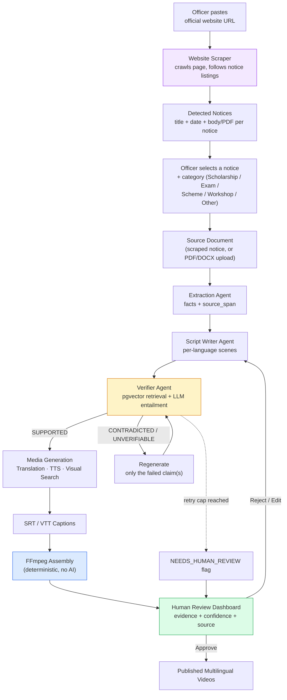

# VaaniReach

**Multilingual outreach video generator for public notices.** Point it at a government
website, pick a notice, and get narrated videos in 3+ Indian languages — captioned,
fact-verified against the source, and gated behind a human approval step.

Codeissance · Problem Statement PS-02 · 4-person team · LLM: gpt-oss-120b behind a
swappable provider interface.

> **This README is the context-recovery document.** It carries the full architecture so
> anyone — or any agent — can resume work from a cold start. Goals, non-goals, users,
> scope discipline and the demo script live in [docs/VaaniReach_PRD.md](docs/VaaniReach_PRD.md).

---

## Table of contents

- [The problem](#the-problem)
- [Architecture at a glance](#architecture-at-a-glance)
- [Detailed system architecture](#detailed-system-architecture)
- [Four things that are easy to get wrong](#four-things-that-are-easy-to-get-wrong)
- [The six layers](#the-six-layers)
- [Shared contracts](#shared-contracts)
- [How verification actually works](#how-verification-actually-works)
- [Current build status](#current-build-status)
- [Run it](#run-it)
- [Swapping mocks for real providers](#swapping-mocks-for-real-providers)
- [Layer → owner](#layer--owner)
- [Documentation](#documentation)
- [Notes for whoever picks this up](#notes-for-whoever-picks-this-up)

---

## The problem

Government, institutional, and public-interest announcements are published as dense,
English-only text — press releases, circulars, public notices, advisories — and reach
only a fraction of their intended audience, because they are neither multilingual nor
available in a format anyone actually consumes. Producing narrated, multilingual,
captioned video versions of every notice by hand does not scale.

VaaniReach automates that **without ever inventing a fact.** It is designed to source
from generic, publicly accessible notice-publishing websites — PIB, state portals,
university and board notice pages, municipal sites — rather than any single proprietary
portal, so the pipeline is reusable across any institution that publishes public notices.

---

## Architecture at a glance



**In one line:** an officer never uploads a fact — they point at a website and pick a
notice. Everything from extraction onward is exactly as strict as it looks. Category
selection is cosmetic (visual/tone template only) and never bypasses fact verification.

---

## Detailed system architecture

The same system with the actual infrastructure layers, the per-language fan-out, and the
full repair/escalation branching made explicit.

```
                              OFFICER
                                 │
                                 ▼
                    Paste Official Website URL
                                 │
                                 ▼
                          Website Scraper
                     httpx fetch → selectolax parse
                                 │
                                 ▼
                    Detect Notices on the Page
              (listing rows: link + date  →  N notices
               OR single-page fallback  →  1 notice)
                                 │
                                 ▼
                 ┌──────────────────────────┐
                 │ Officer selects a notice  │
                 │ + category (cosmetic hint,│
                 │ never a fact source):     │
                 │                           │
                 │ ○ Scholarship Notice      │
                 │ ○ Exam Notification       │
                 │ ○ New Scheme              │
                 │ ○ Workshop Announcement   │
                 │ ○ Other                   │
                 └────────────┬──────────────┘
                              │
                              ▼
                      Select Languages
                      Hindi | Marathi | ...
                              │
                              ▼
                         ┌─────────────────────┐
                         │      Next.js        │
                         │   Review Dashboard  │
                         └──────────┬──────────┘
                                    │
                              REST / WebSocket
                                    │
                         ┌──────────▼──────────┐
                         │       FastAPI       │
                         │    Orchestrator     │
                         └──────────┬──────────┘
                                    │
                            Job Queue (Redis)
                                    │
                         ┌──────────▼──────────┐
                         │      LangGraph      │
                         │    Agent Workflow   │
                         └──────────┬──────────┘
                                    │
                         ┌──────────▼──────────┐
                         │  Extraction Agent   │
                         │  LLM · structured   │
                         └──────────┬──────────┘
                                    │
                            facts + source_span
                                    │
                              ┌─────▼─────┐
                              │  Facts DB │
                              └─────┬─────┘
                                    │
                  ╔═════════════════▼═════════════════╗
                  ║   per language  (hi · mr · ta)    ║
                  ╚═════════════════╤═════════════════╝
                                    │
       ┌────────────────────────────▼──────────────────────────┐
       │                                                       │
       │            ┌──────────────────────┐                   │
       └───────────►│  Script Writer Agent │                   │
       repair       │   facts → scenes     │                   │
       feedback     └──────────┬───────────┘                   │
       (failed                 │                               │
        scenes                 ▼                               │
        only)            ┌──────────┐                          │
       │                 │Scripts DB│                          │
       │                 └────┬─────┘                          │
       │                      │                                │
       │           ┌──────────▼───────────┐                    │
       │           │    Verifier Agent    │                    │
       │           └──────────┬───────────┘                    │
       │                      │                                │
       │            ┌─────────▼──────────┐                     │
       │            │  pgvector search   │  retrieve top-3     │
       │            │      no LLM        │                     │
       │            └─────────┬──────────┘                     │
       │                      │                                │
       │            ┌─────────▼──────────┐                     │
       │            │ strict token gate  │  numbers · dates    │
       │            │   regex · no LLM   │  names · locations  │
       │            └─────────┬──────────┘                     │
       │                      │  passes gate                   │
       │            ┌─────────▼──────────┐                     │
       │            │     LLM verify     │  entailment         │
       │            │  SUPPORTED /       │                     │
       │            │  CONTRADICTED /    │                     │
       │            │  UNVERIFIABLE      │                     │
       │            └─────────┬──────────┘                     │
       │                      │                                │
       │        ┌─────────────┴─────────────┐                  │
       │      FAIL                        PASS                 │
       │        │                           │                  │
       │  ┌─────▼──────┐                    │                  │
       │  │ attempt<3? │                    │                  │
       │  └──┬──────┬──┘                    │                  │
       │  yes │      │ no                   │                  │
       └──────┘      │                      │                  │
                     ▼                      │                  │
          ┌─────────────────────┐           │                  │
          │ NEEDS_HUMAN_REVIEW  │           │                  │
          │  flag + reason      │           │                  │
          └──────────┬──────────┘           │                  │
                     │                      │                  │
                     │           ┌──────────▼──────────┐       │
                     │           │     Translation     │       │
                     │           │  AFTER verification │       │
                     │           └──────────┬──────────┘       │
                     │                      │                  │
                     │        ┌─────────────┴─────────────┐    │
                     │        │                           │    │
                     │        ▼                           ▼    │
                     │  ┌───────────┐            ┌──────────────┐
                     │  │    TTS    │            │ Visual search│
                     │  │ audio +   │            │  + generate  │
                     │  │ timings   │            │  (parallel)  │
                     │  └─────┬─────┘            └───────┬──────┘
                     │        │                          │      │
                     │        ▼                          │      │
                     │  ┌───────────┐                     │     │
                     │  │ SRT / VTT │  built from         │     │
                     │  │           │  TTS timings        │     │
                     │  └─────┬─────┘                     │     │
                     │        │                           │     │
                     │        └─────────────┬─────────────┘     │
                     │                      │                   │
                     │           ┌──────────▼──────────┐        │
                     │           │       FFmpeg        │        │
                     │           │  deterministic      │        │
                     │           │  zero AI calls      │        │
                     │           └──────────┬──────────┘        │
                     │                      │                   │
                     │           ┌──────────▼──────────┐        │
                     │           │    Final Video      │        │
                     │           └──────────┬──────────┘        │
                     │                      │                   │
                     └──────────┬───────────┘                   │
                                │                               │
                     ┌──────────▼──────────┐                    │
                     │   Human Approval    │◄───────────────────┘
                     │  evidence + flags   │
                     └──────────┬──────────┘
                                │
                    ┌───────────┴───────────┐
                  approve                 reject
                    │                       │
                    ▼                       └──► back to Script Writer
              PUBLISHED
```

---

## Four things that are easy to get wrong

- The three agents are **sequential**, not fanned out — extraction must finish before
  writing, writing before verifying. Only the *languages* run in parallel.
- The repair loop **closes** — `FAIL → attempt<3? → yes` routes back into the Script
  Writer with only the failed scenes and the rejection reason, not a full re-generation.
- The **strict token gate sits between pgvector search and LLM verify** — deterministic,
  regex-only, runs before the model ever sees the claim, so it cannot be talked out of
  flagging a wrong number.
- **Translation → TTS → SRT/VTT is a chain**, not parallel — captions are built from TTS
  timestamps, so they cannot exist before TTS does. Visual search is the one branch that
  genuinely runs in parallel, since it keys off scene keywords rather than audio.

---

## The six layers

Layers are deliberately independent, so four people can build in parallel once the
contracts in `backend/app/schemas.py` are locked.

```
┌─────────────────────────────────────────────────────────┐
│ L6 — Presentation Layer (Review Dashboard, Next.js)      │
├─────────────────────────────────────────────────────────┤
│ L5 — Orchestration Layer (Job Queue, State Machine)      │
├─────────────────────────────────────────────────────────┤
│ L4 — Agentic Generation & Verification Layer             │
│      (Extraction, Script Writer, Verifier agents)        │
├─────────────────────────────────────────────────────────┤
│ L3 — Multilingual & Media Layer                          │
│      (Translation, TTS, Visual Selection)                │
├─────────────────────────────────────────────────────────┤
│ L2 — Assembly Layer (Captions, ffmpeg video rendering)   │
├─────────────────────────────────────────────────────────┤
│ L1 — Data & Ingestion Layer (DB, source doc parsing,     │
│      storage, MCP tool exposure)                         │
└─────────────────────────────────────────────────────────┘
```

### L1 — Data & Ingestion

- **Website scraper (officer entry point).** Officer pastes an official website URL
  instead of uploading a file. The scraper crawls the page, follows notice/circular
  listings, and detects individual notices (title, publish date, body text or linked PDF)
  as distinct candidates — a government page is rarely one notice, it is usually a list.
- **Notice category selection.** Scholarship Notice, Exam Notification, New Scheme,
  Workshop Announcement, Other. This is a **presentation hint, not a data source** — it
  never overrides extracted facts, it only selects the visual/tone template.
- PDF/DOCX/plain-text upload remains the fallback for notices not on a scrapable page.
- Parsing: `pdfplumber` / `PyMuPDF`, `python-docx`. Scraping: `httpx` + `selectolax`.
- **Database: Supabase (PostgreSQL + pgvector)** — one managed service covers the
  relational schema, vector similarity search, storage and realtime, with no separate
  vector database. Tables: `users, jobs, documents, scraped_notices, facts,
  fact_embeddings, scripts, script_claims, fact_checks, media_assets, videos, reviews`.
- MCP tool (`generate_outreach_video`) as a **thin wrapper** around the job-start
  endpoint. Pipeline logic stays server-side; MCP is a calling interface, not a place to
  duplicate logic.

### L2 — Assembly

- SRT/VTT caption generation from TTS timestamps.
- Deterministic `ffmpeg` rendering: scene sequencing, Ken Burns pan/zoom, fade
  transitions, subtitle burn-in or soft-sub, audio muxing, intro title card, outro
  source attribution.
- **No AI calls in this layer.** Deliberate: it proves the system is not "just an LLM
  wrapper", and makes output reproducible, debuggable, and free to re-run.

### L3 — Multilingual & Media

- **Translation**: Sarvam Translate primary, Gemini fallback behind the same interface.
- **TTS**: Sarvam Bulbul primary, Gemini TTS fallback. Per-scene timestamps feed directly
  into L2. Voice personalization is a structured parameter:
  `{"language": "hi", "voice": "...", "style": "official", "speed": 1.0}`.
- **Visuals**: Gemini image generation, keyword-driven Pexels stock search, and a
  generated title card when neither returns something relevant. Visual generation never
  blocks the pipeline.
- Every provider sits behind a small interface so a failing or slow provider can be
  swapped without touching pipeline logic:

```python
class TranslationProvider:
    async def translate(self, text: str, target_lang: str) -> str: ...

class TTSProvider:
    async def synthesize(self, scenes, voice: VoiceConfig, out_path) -> AudioAsset: ...

class VisualProvider:
    async def get_image(self, scene: Scene, out_path) -> ImageAsset: ...
```

### L4 — Agentic Generation & Verification

Orchestrated as a **LangGraph** workflow — an explicit, inspectable graph rather than
hand-rolled control flow. The graph state *is* the "show your work" artifact.

- **Extraction Agent**: source document → structured, source-cited fact list, embedded
  for retrieval.
- **Script Writer Agent**: fact list → per-language narration script, split into scenes.
- **Verifier Agent**: retrieves top-3 candidate source facts via pgvector, then runs an
  LLM entailment check against only those candidates. Verdicts: `SUPPORTED |
  CONTRADICTED | UNVERIFIABLE | NEEDS_HUMAN_REVIEW`. Stricter matching for dates,
  numbers, names, locations and deadlines than for descriptive claims.
- Three agents only, deliberately small — the differentiator is the **feedback loop
  between them**, not agent count. Bounded at 3 attempts.

### L5 — Orchestration

- Job state machine:
  `queued → extracting → scripting → verifying → generating_media → assembling →
  pending_review → approved/rejected`. Legal transitions are enforced by the
  `TRANSITIONS` map in `schemas.py`.
- **Redis + a lightweight worker.** No Kafka — unnecessary for a batch pipeline.
- Retry/fallback on every external API call. Chain order in the env var *is* the fallback
  order. Degrade gracefully rather than halting the job.
- REST + WebSocket to the dashboard for live per-language status.

### L6 — Presentation

- **Stack**: Next.js + Tailwind CSS + shadcn/ui.
- Create Job → Upload/URL → Language Selection → Live Pipeline Status → Script Review →
  Fact Verification → Video Preview → Subtitle Export → Approve/Reject/Request-Edit →
  Job History.
- Live status from L5's WebSocket feed, per language.
- Script review with fact-level highlighting: colour-coded by verdict and confidence,
  evidence span, and a link back to the original source sentence.
- Unresolved claims shown distinctly (⚠ NEEDS HUMAN REVIEW, with reason), never hidden.

---

## Shared contracts

Locked at T+0. Python source of truth: [`backend/app/schemas.py`](backend/app/schemas.py).
JSON Schema mirrors for the frontend: [`shared/schemas/`](shared/schemas/).
**Changing these breaks every branch at once — announce before touching.**

```json
// Fact
{ "id": "f1", "claim": "string", "type": "date|number|name|policy|location|other",
  "source_span": "verbatim text this claim was extracted from" }

// Script (per language)
{ "script_id": "scr_...", "job_id": "job_...", "language": "hi",
  "scenes": [ { "scene_id": "s1", "text": "string",
                "referenced_fact_ids": ["f1","f3"], "visual_keywords": ["..."] } ] }

// FactCheck
{ "claim_id": "s1", "claim_text": "string",
  "verdict": "SUPPORTED | CONTRADICTED | UNVERIFIABLE | NEEDS_HUMAN_REVIEW",
  "confidence": 0.0, "evidence_span": "string", "evidence_fact_id": "f1",
  "reason": "why it failed — fed back to the writer on repair", "attempt": 1 }

// JobStatus  (L5 → L6, over WebSocket)
{ "job_id": "job_...", "stage": "verifying", "languages": ["hi","mr","ta"],
  "progress": { "hi": "verifying", "mr": "scripting", "ta": "queued" }, "error": null }
```

---

## How verification actually works

**Observe → Ground → Act → Verify → Repair → Escalate.** Concretely, per claim:

1. **Retrieve** — top-3 candidate source facts via pgvector cosine similarity, using a
   local multilingual embedding model. No LLM, no API cost.
2. **Strict token gate** — regex over numbers, dates, currency and percentages.
   Deterministic. Applies to `date`, `number`, `name`, `location` claims. A failure here
   is `CONTRADICTED` immediately, **without the model ever seeing the claim**.
3. **LLM entailment** — only for claims that pass the gate, and only against those 3
   facts. Returns a verdict, a confidence, and the evidence span it relied on.
4. **Repair** — failed scenes only, with the rejection reason and correct evidence
   attached, sent back to the Writer. Passing scenes are untouched.
5. **Escalate** — after 3 attempts, flag `NEEDS_HUMAN_REVIEW` with the reason. The system
   never silently publishes an unverified claim.

The gate runs **before** the LLM because a regex cannot be talked out of flagging a wrong
number, and a language model can. That rule is what catches `12000 → 21000`, which
embedding similarity alone waves straight through.

---

## Current build status

Keep this table current as branches merge — it is the fastest way to re-orient after a
context reset.

| Component | Path | Status |
|---|---|---|
| Shared contracts | `backend/app/schemas.py`, `shared/schemas/` | ✅ **Frozen at T+0** |
| Agent loop (extract → write → verify → repair → escalate) | `backend/app/agents/graph.py` | ✅ Works, hand-rolled async |
| Extraction + source-span hallucination guard | `agents/extraction_agent.py` | ✅ Against mock LLM |
| Script writer + targeted repair | `agents/writer_agent.py` | ✅ Against mock LLM |
| Verifier + strict token gate | `agents/verifier_agent.py` | ⚠️ Retrieval is lexical Jaccard, not pgvector |
| Job state machine + legal transitions | `orchestration/job_manager.py` | ⚠️ In-memory dict, not persisted |
| Retry / provider fallback chain | `orchestration/retry_fallback.py` | ✅ Works |
| SRT/VTT captions | `assembly/captions.py` | ✅ Against mock timings |
| FFmpeg pipeline | `assembly/ffmpeg_pipeline.py` | ✅ Ken Burns + concat + mux |
| Provider interfaces + mocks | `providers/base.py`, `providers/mock.py` | ✅ All four ABCs, all four mocks |
| Project rules for coding agents | `AGENTS.md` | ✅ Committed |
| **LangGraph port** | `agents/graph.py` | ❌ Dep commented out in `requirements.txt` |
| **pgvector retrieval + embeddings** | `agents/embeddings.py` | ❌ Not written |
| **Real LLM provider (Groq gpt-oss)** | `providers/llm/` | ❌ Empty — **blocks all 3 agents** |
| **Provider registry** | `providers/__init__.py` | ❌ 0 bytes |
| **Real translation / TTS / visual providers** | `providers/{translation,tts,visuals}/` | ❌ Empty |
| **FastAPI app + routes** | `main.py`, `config.py`, `api/routes.py` | ❌ Nothing imports fastapi — **blocks frontend** |
| **Database layer** | `db/` | ❌ Empty |
| **Ingestion: scraper + parsers** | `ingestion/` | ❌ Empty |
| **Redis worker** | `orchestration/worker.py` | ❌ Not written |
| **WebSocket feed** | `orchestration/ws.py` | ❌ Not written |
| **MCP server** | `mcp/server.py` | ❌ Empty |
| **Next.js dashboard** | `frontend/` | ❌ Directory does not exist |

**Two critical-path items:** `providers/llm/` blocks all three agents, and the FastAPI app
blocks the entire frontend. Ship those first.

---

## Run it

```bash
pip install pydantic                       # only hard dep for the mock skeleton
python scripts/run_flow.py                 # notice → 3 languages → mp4
python backend/tests/test_repair_loop.py   # proves the agent loop is real
```

Requires `ffmpeg` on PATH. No API keys needed — the mock providers cover every stage.

For real providers, copy `backend/.env.example` to `backend/.env` and fill in the keys
your layer needs. All five services have a free tier; none require a credit card.

**`scripts/run_flow.py` must keep passing with mock providers at all times** — it is how
the other three test your layer without your API keys.

---

## Swapping mocks for real providers

Nothing in the pipeline imports a concrete provider. Implement the interface in
[`backend/app/providers/base.py`](backend/app/providers/base.py), register it, done:

```python
# app/providers/tts/sarvam_tts.py
class SarvamTTS(TTSProvider):
    name = "sarvam_tts"
    async def synthesize(self, scenes, voice, out_path) -> AudioAsset:
        ...  # must return per-scene timings — captions + ffmpeg depend on them
```

```bash
# backend/.env — the chain order IS the fallback policy
TTS_PROVIDERS=sarvam_tts,gemini_tts,mock
```

Keep `mock` last so the demo survives a dead network.

---

## Layer → owner

| Path | Layer | Owner |
|---|---|---|
| `backend/app/providers/`, `backend/app/assembly/` | L3, L2 | **Pruthvi** |
| `backend/app/agents/` | L4 | **Shreyas** |
| `frontend/` | L6 | **Shaurya** |
| `backend/app/{db,ingestion,orchestration,mcp,api}/`, `main.py`, `config.py` | L1, L5 | **Vanshita** |
| `backend/app/schemas.py`, `shared/schemas/` | contracts | **all — locked at T+0** |

One feature per branch, cut from `develop`. Commit format: `[feature-name] what changed`.
Never push to `main`. See [AGENTS.md](AGENTS.md) for the full workflow and the
confirm-before-push rule.

---

## Documentation

| Doc | What's in it |
|---|---|
| [docs/VaaniReach_PRD.md](docs/VaaniReach_PRD.md) | Full spec — goals, non-goals, users, model-tier strategy, provider table, scope discipline, demo flow, success metrics |
| [docs/VaaniReach_Folder_Structure_and_Git_Workflow.md](docs/VaaniReach_Folder_Structure_and_Git_Workflow.md) | Target tree, branch naming, integration checkpoints |
| [AGENTS.md](AGENTS.md) | Project rules — folder ownership, hard constraints, git workflow. Auto-loaded by Antigravity |
| [shared/schemas/](shared/schemas/) | The four JSON contracts the frontend generates its types from |

---

## Notes for whoever picks this up

- `backend/app/schemas.py` is the contract. Changing it breaks every branch at once —
  announce before touching.
- Verification runs on the **source language, before translation**. Reversing that order
  launders errors through the translator and makes them invisible.
- `retrieve_top_k` in `verifier_agent.py` is lexical for now. Swap the body for a pgvector
  cosine query; the signature is already right.
- `graph.py` node boundaries map 1:1 onto LangGraph nodes if/when you port it.
- Strict types (date/number/name/location) require exact token match. That rule is what
  catches `12000 → 21000`, which embedding similarity alone waves through.
- Captions come from TTS timings, never re-transcription — re-transcribing would add a
  second place for facts to drift, which is exactly what this project exists to prevent.
- Every `Fact` carries a verbatim `source_span`. No span, no fact. That span is the
  evidence a reviewer clicks back to.
- The FFmpeg layer takes **zero** AI calls. If you find yourself adding one, you are
  solving the wrong problem.
