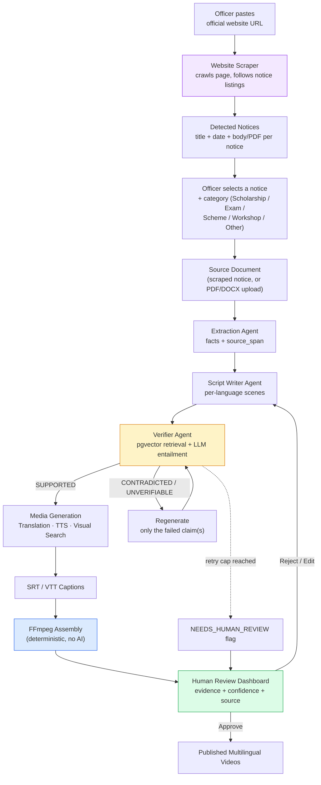

# VaaniReach — Product Requirements Document

**Problem Statement:** PS-02 — Multilingual Outreach Video Generator
**Version:** 1.2
**Team Size:** 4
**LLM Provider:** gpt-oss-120b (open-weight 120B model, served via API), accessed through an abstracted LLM provider interface so the underlying model can be swapped without touching pipeline logic

> **Changelog v1.1 → v1.2**
> - Website scraper added as the officer entry point (paste a URL, detect the notices on that page) — replaces upload-first as the primary path.
> - Notice category selection added (cosmetic template hint, never a fact source).
> - §11 rewritten as a complete APIs & Services table, including rows marked *no external API*.
> - Detailed infra + agent-loop architecture diagram added alongside the Mermaid one.
> - Member-wise division of work removed from this doc. Ownership now lives in [`AGENTS.md`](../AGENTS.md) and the README, which carry the real names and stay in sync with the branch table.

---

## Architecture at a Glance

A single diagram of the full pipeline — source document in, approved multilingual video out — before the detailed sections below.



**Reading it in one line:** an officer never uploads a fact — they point at a website and pick a notice; everything from extraction onward is exactly as strict as before. Category selection is cosmetic (visual/tone template only) and never bypasses fact verification.

### Detailed System Architecture (infra + agent loop)

The Mermaid diagram above shows the *conceptual* flow. This is the same system with the actual infrastructure layers, the per-language fan-out, and the full repair/escalation branching made explicit — useful when reasoning about what each service call actually is.

```
                              OFFICER
                                 │
                                 ▼
                    Paste Official Website URL
                                 │
                                 ▼
                          Website Scraper
                     httpx fetch → selectolax parse
                                 │
                                 ▼
                    Detect Notices on the Page
              (listing rows: link + date  →  N notices
               OR single-page fallback  →  1 notice)
                                 │
                                 ▼
                 ┌──────────────────────────┐
                 │ Officer selects a notice  │
                 │ + category (cosmetic hint,│
                 │ never a fact source):     │
                 │                           │
                 │ ○ Scholarship Notice      │
                 │ ○ Exam Notification       │
                 │ ○ New Scheme              │
                 │ ○ Workshop Announcement   │
                 │ ○ Other                   │
                 └────────────┬──────────────┘
                              │
                              ▼
                      Select Languages
                      Hindi | Marathi | ...
                              │
                              ▼
                         ┌─────────────────────┐
                         │      Next.js        │
                         │   Review Dashboard  │
                         └──────────┬──────────┘
                                    │
                              REST / WebSocket
                                    │
                         ┌──────────▼──────────┐
                         │       FastAPI       │
                         │    Orchestrator     │
                         └──────────┬──────────┘
                                    │
                            Job Queue (Redis)
                                    │
                         ┌──────────▼──────────┐
                         │      LangGraph      │
                         │    Agent Workflow   │
                         └──────────┬──────────┘
                                    │
                         ┌──────────▼──────────┐
                         │  Extraction Agent   │
                         │  LLM · structured   │
                         └──────────┬──────────┘
                                    │
                            facts + source_span
                                    │
                              ┌─────▼─────┐
                              │  Facts DB │
                              └─────┬─────┘
                                    │
                  ╔═════════════════▼═════════════════╗
                  ║   per language  (hi · mr · ta)    ║
                  ╚═════════════════╤═════════════════╝
                                    │
       ┌────────────────────────────▼──────────────────────────┐
       │                                                       │
       │            ┌──────────────────────┐                   │
       └───────────►│  Script Writer Agent │                   │
       repair       │   facts → scenes     │                   │
       feedback     └──────────┬───────────┘                   │
       (failed                 │                               │
        scenes                 ▼                               │
        only)            ┌──────────┐                          │
       │                 │Scripts DB│                          │
       │                 └────┬─────┘                          │
       │                      │                                │
       │           ┌──────────▼───────────┐                    │
       │           │    Verifier Agent    │                    │
       │           └──────────┬───────────┘                    │
       │                      │                                │
       │            ┌─────────▼──────────┐                     │
       │            │  pgvector search   │  retrieve top-3     │
       │            │      no LLM        │                     │
       │            └─────────┬──────────┘                     │
       │                      │                                │
       │            ┌─────────▼──────────┐                     │
       │            │ strict token gate  │  numbers · dates    │
       │            │   regex · no LLM   │  names · locations  │
       │            └─────────┬──────────┘                     │
       │                      │  passes gate                   │
       │            ┌─────────▼──────────┐                     │
       │            │     LLM verify     │  entailment         │
       │            │  SUPPORTED /       │                     │
       │            │  CONTRADICTED /    │                     │
       │            │  UNVERIFIABLE      │                     │
       │            └─────────┬──────────┘                     │
       │                      │                                │
       │        ┌─────────────┴─────────────┐                  │
       │      FAIL                        PASS                 │
       │        │                           │                  │
       │  ┌─────▼──────┐                    │                  │
       │  │ attempt<3? │                    │                  │
       │  └──┬──────┬──┘                    │                  │
       │  yes │      │ no                   │                  │
       └──────┘      │                      │                  │
                     ▼                      │                  │
          ┌─────────────────────┐           │                  │
          │ NEEDS_HUMAN_REVIEW  │           │                  │
          │  flag + reason      │           │                  │
          └──────────┬──────────┘           │                  │
                     │                      │                  │
                     │           ┌──────────▼──────────┐       │
                     │           │     Translation     │       │
                     │           │  AFTER verification │       │
                     │           └──────────┬──────────┘       │
                     │                      │                  │
                     │        ┌─────────────┴─────────────┐    │
                     │        │                           │    │
                     │        ▼                           ▼    │
                     │  ┌───────────┐            ┌──────────────┐
                     │  │    TTS    │            │ Visual search│
                     │  │ audio +   │            │  + generate  │
                     │  │ timings   │            │  (parallel)  │
                     │  └─────┬─────┘            └───────┬──────┘
                     │        │                          │      │
                     │        ▼                          │      │
                     │  ┌───────────┐                     │     │
                     │  │ SRT / VTT │  built from         │     │
                     │  │           │  TTS timings        │     │
                     │  └─────┬─────┘                     │     │
                     │        │                           │     │
                     │        └─────────────┬─────────────┘     │
                     │                      │                   │
                     │           ┌──────────▼──────────┐        │
                     │           │       FFmpeg        │        │
                     │           │  deterministic      │        │
                     │           │  zero AI calls      │        │
                     │           └──────────┬──────────┘        │
                     │                      │                   │
                     │           ┌──────────▼──────────┐        │
                     │           │    Final Video      │        │
                     │           └──────────┬──────────┘        │
                     │                      │                   │
                     └──────────┬───────────┘                   │
                                │                               │
                     ┌──────────▼──────────┐                    │
                     │   Human Approval    │◄───────────────────┘
                     │  evidence + flags   │
                     └──────────┬──────────┘
                                │
                    ┌───────────┴───────────┐
                  approve                 reject
                    │                       │
                    ▼                       └──► back to Script Writer
              PUBLISHED
```

**Four things this diagram makes explicit that are easy to get wrong:**
- The three agents are **sequential**, not fanned out — extraction must finish before writing, writing before verifying. Only the *languages* run in parallel.
- The repair loop **closes** — `FAIL → attempt<3? → yes` routes back into the Script Writer with only the failed scenes and the rejection reason, not a full re-generation.
- The **strict token gate sits between pgvector search and LLM verify** — deterministic, regex-only, runs before the model ever sees the claim, so it can't be talked out of flagging a wrong number.
- **Translation → TTS → SRT/VTT is a chain**, not parallel — captions are built from TTS timestamps, so they can't exist before TTS does. Visual search is the one branch that genuinely runs in parallel, since it keys off scene keywords rather than audio.

For the layer-by-layer technical breakdown, see Section 5.

---

## 1. Overview

Government, institutional, and public-interest announcements are frequently published as dense, English-only text — press releases, circulars, public notices, advisories — and reach only a fraction of their intended audience because they are neither multilingual nor accessible in a video/audio format. Manually producing narrated, multilingual, captioned video versions of every notice does not scale.

**VaaniReach** is an agentic AI pipeline that ingests a source document (a press release, public notice, or official announcement — sourced from any publicly available government or institutional website, e.g. PIB, state government portals, university/board notice pages, municipal corporation sites, etc.) and automatically produces short narrated outreach videos in multiple Indian languages, with captions, verified factual accuracy against the source, and a human review gate before publication.

The system is explicitly designed to source from **generic, publicly accessible notice-publishing websites** rather than any single proprietary or organization-specific portal, so the pipeline is reusable across any department, university, or institution that publishes public notices.

---

## 2. Goals

- Convert a single source document into narrated videos in **3+ Indian languages** (compulsory), with **all bonus languages** supported as a stretch goal.
- Preserve **exact factual consistency** with the source document — no hallucinated dates, numbers, names, or claims.
- Provide **evidence-backed verification** for every factual claim in the generated script, with per-claim confidence and source citation.
- Provide a **human-in-the-loop review dashboard** — no video is considered "published" until a human explicitly approves it.
- Ship all listed bonus features (additional languages, automatic visual selection, voice personalization, fact-level highlighting, subtitle export, MCP media tool) as first-class features, not afterthoughts.
- Demonstrate a genuinely agentic system (multi-step generation + verification loop with bounded retries and graceful degradation) rather than a single-shot LLM wrapper.

## 3. Non-Goals

- Real-time/live translation or streaming (batch pipeline only).
- Full avatar/lip-synced presenter video (out of scope — static/animated visual + narration only).
- Editing arbitrary long-form video (source documents are notices/press releases, not full articles or reports).
- Guaranteeing 100% automated fact-checking with zero human oversight — the system always defers to a human reviewer for final publication.

---

## 4. Users

| User | Need |
|---|---|
| Content/Communications Officer | Upload a notice, get ready-to-publish multilingual videos without manual translation/editing work |
| Reviewer/Approver | Verify factual accuracy and language quality before anything goes live |
| End Citizen (indirect) | Receives an accurate, accessible, native-language video/audio version of an official announcement |

---

## 5. System Architecture — Layers

The system is organized into **six layers**. Layers are designed to be as independent as possible so team members can build in parallel after the shared contracts (schemas/API shapes) in Section 6 are agreed on Day 0.

```
┌─────────────────────────────────────────────────────────┐
│ L6 — Presentation Layer (Review Dashboard, Next.js)      │
├─────────────────────────────────────────────────────────┤
│ L5 — Orchestration Layer (Job Queue, State Machine)      │
├─────────────────────────────────────────────────────────┤
│ L4 — Agentic Generation & Verification Layer             │
│      (Extraction, Script Writer, Verifier agents)        │
├─────────────────────────────────────────────────────────┤
│ L3 — Multilingual & Media Layer                          │
│      (Translation, TTS, Visual Selection)                │
├─────────────────────────────────────────────────────────┤
│ L2 — Assembly Layer (Captions, ffmpeg video rendering)   │
├─────────────────────────────────────────────────────────┤
│ L1 — Data & Ingestion Layer (DB, source doc parsing,     │
│      storage, MCP tool exposure)                         │
└─────────────────────────────────────────────────────────┘
```

### L1 — Data & Ingestion Layer
- **Website scraper (officer entry point)**: officer pastes an official website URL instead of uploading a file. The scraper crawls the page, follows notice/circular listing pages, and detects individual notices (title, publish date, body text or linked PDF) as distinct candidates — a single govt page is rarely one notice, it's usually a list of them.
- **Notice category selection**: officer picks a category for the selected notice — Scholarship Notice, Exam Notification, New Scheme, Workshop Announcement, or Other. This is a **presentation hint, not a data source** — it never overrides extracted facts, it only selects the visual/tone template (e.g. a scheme notice gets a more formal scene style than a workshop announcement) so output feels purpose-built rather than generic.
- Source document upload (PDF/DOCX/plain text) remains the fallback path for notices not hosted on a scrapable page.
- Parsing: `pdfplumber`/`PyMuPDF`, `python-docx`; scraping via `httpx` + `selectolax`/`BeautifulSoup`.
- **Database: Supabase (PostgreSQL + pgvector)** — one managed service gives us the relational schema, vector similarity search for evidence retrieval, auth, storage, and realtime, without introducing a separate vector database. Tables: `users, jobs, documents, scraped_notices, facts, fact_embeddings, scripts, script_claims, fact_checks, media_assets, videos, reviews`.
- Object storage: Supabase Storage (or an S3-compatible bucket if needed) for uploaded docs, generated audio, images, final video.
- MCP tool exposure (`generate_outreach_video`) as a **thin wrapper** around the orchestration layer's job-start endpoint — the full pipeline logic stays server-side; MCP is purely an external calling interface, not a place to duplicate pipeline logic.

### L2 — Assembly Layer
- SRT/VTT caption generation from TTS timestamps.
- Deterministic `ffmpeg`-based video rendering: image/scene sequencing, Ken Burns pan/zoom, fade transitions, subtitle burn-in or soft-sub, audio muxing, intro/title card, outro/source attribution.
- **No AI calls in this layer** — pure deterministic code. This is a deliberate design choice: it proves the system is not "just an LLM wrapper" and makes output reproducible, debuggable, and inexpensive to re-run.

### L3 — Multilingual & Media Layer
- **Translation**: Sarvam Translate as primary provider (strong Indian-language fit), with IndicTrans2 (self-hostable, open-source) or Google Cloud Translation (managed) as fallback behind the same interface.
- **TTS**: Sarvam Bulbul V3 as primary provider, with ElevenLabs as a premium/fallback option and Gemini TTS as a third benchmark point — selection is not decided on English voice quality alone; Hindi/Marathi/Tamil (or whichever languages are locked) pronunciation, naturalness, latency, cost, and timestamp support are all benchmarked before locking. Word/scene-level timestamp marks (SSML `<mark>` tags) produce audio + timing data feeding directly into L2. Voice personalization is a structured parameter: `{"language": "hi", "voice": "preferred_voice", "style": "official", "speed": 1.0}`.
- **Visuals**: Nano Banana 2 for AI-generated scene images/illustrations (Nano Banana Pro reserved for premium/hero scenes), with a keyword-driven stock image search and a generated title-card fallback when neither produces a relevant result — visual generation never blocks the pipeline.
- **Optional B-roll enhancement (bonus, not core)**: short (5–8s) AI video clips via Veo 3.1 Fast or Gemini Omni Flash can supplement the static-image Ken Burns approach for hero scenes. This is explicitly a bonus layer on top of an already-complete pipeline — the compulsory "multimodal video generation" requirement is fully satisfied by TTS narration + still/generated images + captions assembled in FFmpeg, so AI video generation is not on the critical path and should only be attempted once L1–L6 core functionality is working end-to-end.
- Every provider above sits behind a small interface so a failing/slow provider can be swapped without touching pipeline logic:
```python
class TranslationProvider:
    async def translate(self, text: str, target_lang: str) -> str: ...

class TTSProvider:
    async def synthesize(self, text: str, voice_config: dict) -> AudioWithTimestamps: ...

class VisualProvider:
    async def get_image(self, scene: Scene) -> ImageAsset: ...
```

### L4 — Agentic Generation & Verification Layer
Orchestrated as a **LangGraph** workflow — this gives an explicit, inspectable graph (rather than hand-rolled control flow) for the generate → verify → repair → escalate loop, which is also easier to demo live (the graph state *is* the "show your work" artifact).

- **Extraction Agent**: source document → structured, source-cited fact list (`facts` + `fact_embeddings`, embedded for retrieval).
- **Script Writer Agent**: fact list → per-language narration script, broken into scenes (`scripts` + `script_claims`).
- **Verifier Agent**: extracts claims from the script, retrieves top-3 candidate source facts via pgvector similarity search, then runs an LLM entailment check against only those candidates. Verdicts: `SUPPORTED | CONTRADICTED | UNVERIFIABLE | NEEDS_HUMAN_REVIEW`. Stricter matching is applied for dates, numbers, names, locations, deadlines, and official policy statements than for general descriptive claims.
- Three agents only, kept deliberately small — the differentiator is the **feedback loop between them**, not agent count. Runs in a bounded retry loop with the Writer Agent (max 3 attempts; see Section 9).
- Produces fact-level confidence scores consumed by both L6 (fact-level highlighting UI) and the reviewer's evidence view.

### L5 — Orchestration Layer
- Job state machine: `queued → extracting → scripting → verifying → generating_media → assembling → pending_review → approved/rejected`.
- Background processing kept intentionally simple: **Redis + a lightweight worker** (no Kafka — unnecessary for a batch, hackathon-scale pipeline).
- Retry/fallback logic for every external API call (translation, TTS, image search) — auto-switch to fallback provider on failure, degrade gracefully rather than halting the job.
- Exposes REST + WebSocket API to the dashboard for live per-language job status, e.g. `{"job_id": "...", "stage": "verifying", "languages": ["hi","mr","ta"], "progress": {"hi": "verifying", "mr": "scripting", "ta": "queued"}}`.

### L6 — Presentation Layer
- **Stack**: Next.js + Tailwind CSS + shadcn/ui.
- Sections: Create Job → Upload/URL → Language Selection → Live Pipeline Status → Script Review → Fact Verification → Video Preview → Subtitle Export → Approve/Reject/Request-Edit → Job History/Analytics.
- Live job status view (per-stage progress, powered by L5's WebSocket feed) — e.g. `Source → Extracting ✓ → Scripting ✓ → Verifying ● → Media Generation → Assembly → Human Review`.
- Script review view — per language, with fact-level highlighting (color-coded by verification confidence, evidence span, and a link back to the original source sentence) sourced from L4's output.
- Video preview player, per-language tabs; subtitle export (SRT/VTT download).
- Approve / Edit / Reject workflow, with reviewer notes stored against the job. Unresolved claims are shown distinctly (⚠ NEEDS HUMAN REVIEW, with reason) rather than silently hidden.

---

## 6. Shared Contracts (define on Day 0, before parallel work starts)

> **Locked at T+0.** The Python source of truth is [`backend/app/schemas.py`](../backend/app/schemas.py); JSON Schema mirrors for the frontend live in [`shared/schemas/`](../shared/schemas/). The shapes below are the PRD-level summary — the files are authoritative and carry the full field set.

### 6.1 Fact object
```json
{
  "id": "f1",
  "claim": "string",
  "type": "date|number|name|policy|location|other",
  "source_span": "verbatim text this claim was extracted from"
}
```

### 6.2 Script object (per language)
```json
{
  "language": "hi",
  "scenes": [
    {
      "scene_id": "s1",
      "text": "string",
      "referenced_fact_ids": ["f1", "f3"]
    }
  ]
}
```

### 6.3 Fact-check verdict object
```json
{
  "claim_id": "f1",
  "verdict": "SUPPORTED | CONTRADICTED | UNVERIFIABLE",
  "confidence": 0.0,
  "evidence_span": "string",
  "attempt": 1
}
```

### 6.4 Job status object (L5 → L6, over WebSocket)
```json
{
  "job_id": "uuid",
  "stage": "verifying",
  "languages": ["hi", "ta", "bn"],
  "progress": { "hi": "scripting", "ta": "verifying", "bn": "queued" }
}
```

Everyone builds against these shapes independently — this is what makes true parallel work possible.

---

## 7. Compulsory Feature Checklist

| Feature | Layer | Status target |
|---|---|---|
| Source document understanding | L1 / L4 | Must-have |
| Multilingual generation (3+ languages) | L3 / L4 | Must-have |
| Multimodal video generation | L2 / L3 | Must-have |
| Agentic production workflow | L4 / L5 | Must-have |
| Fact verification | L4 | Must-have |
| Human review dashboard | L6 | Must-have |

## 8. Bonus Feature Checklist

| Feature | How it's implemented | Layer |
|---|---|---|
| Additional Indian languages | Parameterized language loop through L3/L4 — no new logic needed | L3/L4 |
| Automatic visual selection | Keyword extraction per scene → stock image API → title-card fallback | L3 |
| Voice personalization | Voice/style parameter exposed per TTS call | L3 |
| Fact-level highlighting | Direct UI rendering of L4's per-claim verdict/confidence | L6 |
| Subtitle export | L2's SRT/VTT output exposed as a download | L2/L6 |
| MCP Media Tools | `generate_outreach_video` MCP tool wrapping L5's job-start endpoint | L1/L5 |

---

## 9. Agentic Verification Loop (core "not a wrapper" logic)

Conceptual core of the system — **Observe → Ground → Act → Verify → Repair → Escalate**:

```
OBSERVE   — parse and understand the source notice
GROUND    — extract source-cited facts and retrieve evidence
ACT       — generate multilingual scripts, visuals, and narration
VERIFY    — check every generated factual claim against source evidence
REPAIR    — regenerate only the failed claims (not the whole script)
ESCALATE  — send unresolved claims to human review
```

Concretely:

1. Writer Agent produces a script for language X.
2. Claims are extracted from the script.
3. For each claim: retrieve top-3 candidate source facts via local multilingual embedding similarity (no API cost).
4. Verifier Agent runs an entailment check (LLM call) against the shortlisted facts → `SUPPORTED | CONTRADICTED | UNVERIFIABLE`.
5. If any claim fails: only the failed claims (not the whole script) are sent back to the Writer Agent with the rejection reason attached, and regenerated.
6. Repeat up to a fixed retry cap (e.g. 3 attempts).
7. If still unresolved after the cap: the claim is flagged `NEEDS_HUMAN_REVIEW` and surfaced in the dashboard — the system never silently publishes an unverified claim.

This loop is what makes the system genuinely agentic: two distinct agents with distinct responsibilities, a feedback loop between them, bounded retries, and graceful degradation to a human decision rather than an infinite loop or silent failure.

---

## 10. Model-Tier Strategy

Not every step needs the strongest (or same) model. Splitting work this way keeps the system faster, cheaper, and more technically credible:

| Tier | Used for |
|---|---|
| **Deterministic / cheap** (no LLM) | PDF/DOCX parsing, embedding generation, pgvector similarity retrieval, keyword extraction, SRT/VTT generation, ffmpeg rendering, JSON schema validation |
| **LLM — cheap/fast tier** | Extraction, classification, formatting, simple transformations |
| **LLM — strongest tier** | Claim/entailment reasoning, verification, repairing failed claims |

**Primary LLM: gpt-oss-120b**, called behind a provider interface — this is a config change, not a rewrite, if the team benchmarks and prefers to switch mid-hackathon. If cost/latency tiering across sub-tasks is worth the added surface area, a tiered setup (e.g. a lighter model for extraction/formatting, a stronger one for verification) is a valid pattern to apply within the same interface — evaluate this only after the core loop is working end-to-end, not before.

## 11. APIs & Services Used

Every external dependency in the system, in one place — what it's for, which one is actually used, and what it's called by inside the pipeline. Purely internal/deterministic steps (retrieval, gating, assembly) are listed too, marked **no external API**, so it's unambiguous which stages call out to a paid/managed service and which don't.

| Stage | Task | Provider used | Fallback / benchmark alternative | Called from |
|---|---|---|---|---|
| Ingestion | Website scraping | `httpx` (fetch) + `selectolax` (HTML parse) — **no external API**, self-hosted logic | — | `ingestion/scraper.py` |
| Ingestion | PDF / DOCX parsing | `pdfplumber` / `PyMuPDF`, `python-docx` — **no external API** | — | `ingestion/parsers.py` |
| Extraction, scripting, verification (entailment) | LLM reasoning | **gpt-oss-120b** (served via API), behind an abstracted LLM provider interface | — (interface allows swap without pipeline changes) | `agents/extraction_agent.py`, `agents/writer_agent.py`, `agents/verifier_agent.py` |
| Verification | Evidence retrieval | **pgvector** (Postgres extension, self-hosted via Supabase) — **no external API**, a database query | — | `agents/verifier_agent.py::retrieve_top_k()` |
| Verification | Strict numeric/date gate | Regex, pure Python — **no external API** | — | `agents/verifier_agent.py` |
| Translation | Multilingual generation | **Sarvam Translate** | IndicTrans2 (self-hosted, open-source) / Google Cloud Translation (managed) | `providers/translation/*` |
| Voiceover | Text-to-speech | **Sarvam Bulbul V3** | ElevenLabs (premium) / Gemini TTS (benchmark) | `providers/tts/*` |
| Visuals | Scene images | **Nano Banana 2** | Nano Banana Pro (premium/hero scenes) / stock image search (Pexels) | `providers/visuals/*` |
| Visuals (bonus, optional) | AI video B-roll | **Veo 3.1 Fast** / Gemini Omni Flash | Runway, MiniMax/Hailuo, fal.ai — benchmark only, not core | `providers/visuals/*` (optional extension) |
| Captions | SRT/VTT generation | TTS timestamps (primary source of truth) — **no external API** | WhisperX (only if timestamps are insufficient) | `assembly/captions.py` |
| Assembly | Video rendering | **FFmpeg** (self-hosted) — **no external API**, zero AI calls, deterministic | — | `assembly/ffmpeg_pipeline.py` |
| Data | Relational + vector store | **Supabase (PostgreSQL + pgvector)** | — | `db/` |
| Data | Object storage | **Supabase Storage** | S3-compatible bucket | — |
| Orchestration | Job queue | **Redis** + lightweight worker | — | `orchestration/job_manager.py` |
| Orchestration | Agent workflow graph | **LangGraph** | — | `agents/graph.py` |
| External access | Tool exposure | **MCP** (`generate_outreach_video` tool) | — | `mcp/server.py` |

**Reading this table**: every row marked "no external API" is deterministic or self-hosted — it cannot fail due to a third-party outage and costs nothing per call. The rows with a named provider are exactly where the retry/fallback wrapper (Section 9) applies — each of those calls goes through `with_fallback()`, trying the listed fallback before degrading or failing the stage.

> **Hackathon note:** the build runs on **free tiers only**. In practice that means gpt-oss-120b via **Groq**, translation and TTS via **Sarvam** with **Gemini** as fallback, scene images via **Gemini** with **Pexels** stock search, and **Supabase** free tier for Postgres + pgvector. ElevenLabs, Google Cloud Translation and Veo are documented above as the architecture's premium options but are **not wired in**. Signup steps live in the team build handbook.

**Benchmark, don't guess** — before locking translation/TTS/image providers, run the same 2–3 source documents through each candidate and compare factual accuracy, target-language quality, voice naturalness, generation time, and cost. A useful way to structure this is three end-to-end configurations (cheapest, India-language-focused, premium) run side by side, so the choice is based on actual output rather than a docs page. This benchmarking pass belongs in the first few hours, not squeezed in after the pipeline is built — swapping a provider after everything is wired to it is expensive; swapping before is a config change.

**Cost/scope discipline for optional AI video**: if attempted at all, generate short 5–8s clips for a handful of hero scenes, not a single long AI-generated video — the compulsory "multimodal video generation" requirement is already satisfied by TTS + images/generated stills + captions in FFmpeg, so AI video clips are a visual-polish bonus, never a dependency the core pipeline needs to function.

## 12. What Not to Add (scope discipline)

To keep the build achievable and the architecture legible to judges, explicitly **do not** add:

- A graph database (Neo4j) — Postgres + pgvector covers documents, facts, embeddings, claims, and verification relationships without it.
- Kafka/event bus — Redis + a lightweight worker is sufficient for a batch pipeline at this scale.
- Extra agents beyond Extraction / Writer / Verifier — three agents with a real feedback loop is more defensible than five agents with a rehearsed demo script.
- Any AI call inside the assembly (ffmpeg) layer — it must stay deterministic.
- Models/tools with near-term lifecycle risk as a core dependency (e.g. deprecated video model generations, or any provider with an announced discontinuation date) — fine to study for API patterns, not to build the pipeline on.
- Unofficial automation wrapping a first-party UI tool (e.g. browser automation of a video-generation web UI) as a backend dependency — call the underlying API directly instead.
- A full single-shot AI-generated video for the entire output — generate short clips/stills for scenes and assemble deterministically, not one long AI video render.
- Background music/SFX generation before the compulsory features are done — nice-to-have polish, not a priority until fact verification, 3+ languages, TTS, video, and human review are all working.

Every component in the system should answer one of: *How do we understand the source? How do we prevent hallucinated facts? How do we generate multilingual content? How do we generate the media? How do we verify it? How do we recover from failures? How does a human approve it? How can this be demonstrated live?* If a technology doesn't serve one of these, it doesn't go in.

---

## 13. Demo Flow

The demo should showcase the architecture, not just a finished video:

1. Upload an official notice (or paste a URL) → 2. Show extracted, source-cited facts → 3. Start generation → 4. Dashboard shows live agent stages → 5. Show multilingual script generation → 6. Show verification running → 7. **Deliberately inject an incorrect claim into a test document** → 8. Verifier catches it → 9. Writer regenerates only the failed claim → 10. Verification passes → 11. Generate TTS + visuals → 12. FFmpeg assembles video → 13. Reviewer sees the evidence-backed script → 14. Approve → 15. Show the final multilingual video.

Step 7–10 is the single most important beat in the demo — it's the concrete proof that this is `Generate → Detect → Repair → Verify`, not a single-shot generation tool.

## 14. Success Metrics (for demo/evaluation)

- End-to-end: source document → 3 approved, downloadable videos in under a defined target time (e.g. under 5 minutes per language).
- Fact verification catches the deliberately injected factual error in the demo flow above.
- Pipeline survives a simulated API failure (e.g. translation provider down) via fallback without crashing the job.
- Reviewer can trace any flagged claim back to its exact source sentence in the dashboard (explainability).

---

## 15. Ownership & Workflow

Team ownership, the 24 feature branches, and the git workflow are **not** duplicated here — they live in files that stay in sync with the code:

- [`AGENTS.md`](../AGENTS.md) — folder ownership per person, the hard rules, and the confirm-before-push requirement. Auto-loaded by Antigravity as project rules.
- [`README.md`](../README.md) — full architecture, shared contracts, and a live build-status table.
- [`docs/VaaniReach_Folder_Structure_and_Git_Workflow.md`](VaaniReach_Folder_Structure_and_Git_Workflow.md) — target tree, branch naming, integration checkpoints.
